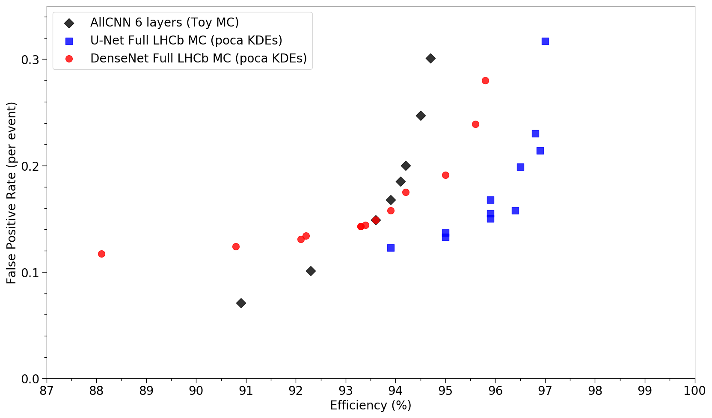

# PV Finder

## Directories:

1. [`gen`](gen): Code to generate events using toy Velo model and produce files with hits and truth information.
2. [`ana`](ana): The code that generates the kernels, either from hits or from tracks. You can also convert hits to tracks using our proto tracking algorithm here.
3. [`model`](model): The ML model definitions
4. [`notebooks`](notebooks): Jupyter notebooks that run the ML models
5. [`scripts`](scripts): Scripts for data processing

For the purposes of this project, the [`model`](model) and [`notebooks`](notebooks) directory are the focus.

Other directories:

* [`dat`](dat): A few tiny sample data files live here
* [`binned_tracking`](binned_tracking): Binned tracking toy code (classic code, CMake compile)
* [`tests`](tests): Minimal testing for now

## Requirements:

All requirements are now part of the `environment.yml` file, for all environments. 

## Presentation Format

It would be unreasonable to expect the grader to go through the environment file, install right packages correctly, set up the environment, and navigate through this large project to reproduce my result without significant hurdles. It is possible but perhaps unreasonable for the scope of this project. Instead, I will be providing screenshots and specific plots that demonstrate that this code is functional and produces the plots I will show here. Hopefully this is sufficient and saves time on both of our parts.

## Overview

To get a big picture of what this project is all about, see `pv-finder_manual.md`. This is a fairly long document but provides the best documentation for touring the project in a relatively understandable manner.

## Key Contributions

For the scope of this project, my key contributions are found in `model/autoencoder_models.py`, `notebooks/utilities.py`, and `script_train_lhcb-mc.py`. The results generated from these files (and many others) are also critical to understanding the project.

### Models

`model/autoencoder_models.py` houses the machine learning autoencoder models of the project. LHCb tracks are converted into the KDE, which in turn produces a histogram that these models use for learning. The data is a 4,000 bin histogram with a series of important peaks that represent primary vertices, which is what _pv_-finder is trying to find. A figure of a KDE can be seen below.


These models are tuned based on intuition, trial and error, and literature in the field. They are, in essence, designed to detect signal from background noise. An example of a model architecture, UNet -- one of the most common models trained on in the project -- is shown below.


For this project, UNet was modified to separately train the perturbative features -- the x and y features of the beamline, which is known to produce small perturbations that can improve the learning process when included. Normally, UNet trains the input features and perturbation as a set of 4 input features to the model. With this change, though, the two are split up and trained in parallel networks, which are then combined at the end through concatenation and brought through an output layer. This new model can be found in `autoencoder_models.py` and is called PerturbativeUNet.

### Data

In addition to altering the model, the data itself was updated to now include nearly-real data. The process is rather complicated to explain, but it can be described as such: during previous research, "toy" Monte Carlo data was being used. This uses Pythia to generate events of proton-proton collision, but the detector and response models are heavily simplified compared to the real LHCb models. There is also very little tracking algorithms executed (i.e. proto-tracking). Instead, the resolution for observing tracking was put in by hand -- if enough hits looked like a straight line, it was used.

Full LHCb Monte Carlo data, however, is the better data. Instead, it takes the 30 MHz of beam crossings with 5.5 visible proton-proton collisions (~150 million primary vertices) and condenses it to 100,000 to 1,000,000 for data limitation reasons. Simulation data for proton-proton collisions is then put through Pythia as before, and only keeps events when the particle decay charm -> D0 -> k_pi occurs.

The data is then divided into four categories: JpsiPhiMagDown, D0piMagUp, MinBiasMagUp, and MinBiasMagDown.

JpsiPhi is the particle decay b_s -> jpsiphi events. It is a proxy for b_s decays.

D0pi handles particle decay b_d -> D + phi.

MinBias handles qq_bar decays with no attention paid to quark flavor. Pythia is allowed to handle the interaction however it likes.

The data is then validated on MinBias. This is done because we want to make sure we reject it, given the fact that we have to reduce the data we accept by a factor of 100-150. Thus, we need to reject 99% of events and only keep the signal.

Once this is all done, the experiment electronics are simulated. This is a rather complicated process, but suffice to say that it accounts for energy lost in electron hole pairs, resolution loss (smearing), inefficiencies, and cross-talk from signals in one wire/signal creating a false signal in another when electronics are close by.

The result is data that, ideally, is indistinguishable from real data and can be used in the same way as real data for simulations.

This new data can be found used in `notebooks/script_train_lhcb-mc.py`. The old toy MC data can be found used in `notebooks/script_train.py`.

### Utilities

`model/utilities.py` was made to offload some of the tasks of the training notebooks to separate functions. One of my major contributions was creating the Param class, which heavily streamlined the process of setting the parameters for a model run. Instead of needing to comb over the notebook and manually change each parameter, the Param class can now be used and the parameters simply changed at the top and applied throughout the notebook.

My contributions also included mlflow integration, but this is somewhat beyond the scope of the presentation and has been done for some time now.

### Training

The notebook `notebooks/script_train_lhcb-mc.py` uses full LHCb Monte Carlo data and a model of our choosing to locate primary vertices. The code is also capable of loading previous run weights and continue training where the previous run left off. The parameters can be easily changed from run to run and is saved in a UC computer's file structure which a third-party program, MLFlow, can scrap and display functional plots and graphs for comparison. This entire notebook is a reworking of an original notebook done by Dr. Michael Sokoloff, head of the pv-finder project. The python file is a collaborative effort between Will Tepe, a former undergraduate at UC, and myself.

### Results

The results of this work are the bulk of the recent work done for this project. Previously, UNet was showing lukewarm results compared to simpler models. This was troubling, as it suggested that either my understanding of machine learning was crumbling or an issue was present. Great lengths were then taken to systematically test components of UNet that may be causing an underperforming model. For reference, the best performing model is shown below. It is the cyan circles on the far right. To explain these plots in great detail is unnecessary. Just keep in mind that down and to the right is the best result. This demonstrates a model with a low false positive rate (i.e. less primary vertices incorrectly indentified) and a high efficiency (i.e. primary vertices correctly identified).


The results I was originally obtaining are given below.



Though the curve is not fully plotted out, it is evident that the results are much less performant.

The results obtained by separating the perturbative features from the X features (as it is typically called) is given below.

GOOD PUNET PLOT HERE


Notice how this is much more in line with the previous model. In fact, the performance is _nearly_ identical. Most likely, more training and some slight parameter tuning (as well as a few other subtle techniques) will be implemented over time to (hopefully) bring the results a couple fractions of a percent higher in efficiency.

### Future Plans

With some preliminary evidence showing that the method of perturbation learning significantly impacts performance, extra steps can be taken to test this hypothesis further. For one, the pertubations (which cause relatively small changes/differences) is trained at the same time as the X features (which drive a majority of the primary vertex detection) are likely assigned equal weights and importance. This does not accurately reflect the behavior of the system. A better method of implementation would be to first train the model without perturbations, freeze these weights, then train the perturbations such that they reflect the minor necessary changes to improve performance. Finally, all weights would be unfrozen and allowed to move as needed. This should help better find local minima and produce better results. This could not be implemented in time for the final project but is coming in the near future.

## Example Output

An example output of running `script_train_lhcb-mc` is given below.

```
(june2020-gpu) bash-4.2$ python script_train_lhcb-mc.py &
[5] 37553
(june2020-gpu) bash-4.2$ Epoch 17: train=1.74027, val=1.75561, took 249.49 s
  Validation Found 91598 of 93880, added 3445 (eff 97.57%) (0.188 FP/event)
1.7402655478037845
HBox(children=(FloatProgress(value=0.0, description='Training', layout=Layout(flex='2'), max=4063.0, style=ProgressStyle(description_width='initial')), HTML(value='')), layout=Layout(display='inline-flex', flex_flow='row wrap', width='100%'))
/apps/miniconda3/envs/june2020-gpu/lib/python3.7/site-packages/awkward/__init__.py:23: DeprecationWarning: Consider switching from 'awkward' to 'awkward1', since the new interface will become the default later this year (2020).

    pip install -U awkward1

In Python:

    >>> import awkward1 as ak
    >>> new_style_array = ak.from_awkward0(old_style_array)
    >>> old_style_array = ak.to_awkward0(new_style_array)

  DeprecationWarning
/apps/miniconda3/envs/june2020-gpu/lib/python3.7/site-packages/awkward/persist.py:27: DeprecationWarning: `np.bool` is a deprecated alias for the builtin `bool`. To silence this warning, use `bool` by itself. Doing this will not modify any behavior and is safe. If you specifically wanted the numpy scalar type, use `np.bool_` here.
Deprecated in NumPy 1.20; for more details and guidance: https://numpy.org/devdocs/release/1.20.0-notes.html#deprecations
  {"minsize": 8192, "types": [numpy.bool_, numpy.bool, numpy.integer], "contexts": "*", "pair": (zlib.compress, ("zlib", "decompress"))},
/apps/miniconda3/envs/june2020-gpu/lib/python3.7/site-packages/h5py/__init__.py:46: DeprecationWarning: `np.typeDict` is a deprecated alias for `np.sctypeDict`.
  from ._conv import register_converters as _register_converters
/apps/miniconda3/envs/june2020-gpu/lib/python3.7/site-packages/numba/core/types/__init__.py:108: DeprecationWarning: `np.long` is a deprecated alias for `np.compat.long`. To silence this warning, use `np.compat.long` by itself. In the likely event your code does not need to work on Python 2 you can use the builtin `int` for which `np.compat.long` is itself an alias. Doing this will not modify any behaviour and is safe. When replacing `np.long`, you may wish to use e.g. `np.int64` or `np.int32` to specify the precision. If you wish to review your current use, check the release note link for additional information.
Deprecated in NumPy 1.20; for more details and guidance: https://numpy.org/devdocs/release/1.20.0-notes.html#deprecations
  long_ = _make_signed(np.long)
/apps/miniconda3/envs/june2020-gpu/lib/python3.7/site-packages/numba/core/ir_utils.py:1525: DeprecationWarning: `np.int` is a deprecated alias for the builtin `int`. To silence this warning, use `int` by itself. Doing this will not modify any behavior and is safe. When replacing `np.int`, you may wish to use e.g. `np.int64` or `np.int32` to specify the precision. If you wish to review your current use, check the release note link for additional information.
Deprecated in NumPy 1.20; for more details and guidance: https://numpy.org/devdocs/release/1.20.0-notes.html#deprecations
  if (hasattr(numpy, value)
/apps/miniconda3/envs/june2020-gpu/lib/python3.7/site-packages/numba/core/ir_utils.py:1525: DeprecationWarning: `np.int` is a deprecated alias for the builtin `int`. To silence this warning, use `int` by itself. Doing this will not modify any behavior and is safe. When replacing `np.int`, you may wish to use e.g. `np.int64` or `np.int32` to specify the precision. If you wish to review your current use, check the release note link for additional information.
Deprecated in NumPy 1.20; for more details and guidance: https://numpy.org/devdocs/release/1.20.0-notes.html#deprecations
  if (hasattr(numpy, value)
/apps/miniconda3/envs/june2020-gpu/lib/python3.7/site-packages/numba/core/consts.py:114: DeprecationWarning: `np.int` is a deprecated alias for the builtin `int`. To silence this warning, use `int` by itself. Doing this will not modify any behavior and is safe. When replacing `np.int`, you may wish to use e.g. `np.int64` or `np.int32` to specify the precision. If you wish to review your current use, check the release note link for additional information.
Deprecated in NumPy 1.20; for more details and guidance: https://numpy.org/devdocs/release/1.20.0-notes.html#deprecations
  return getattr(value, expr.attr)
/apps/miniconda3/envs/june2020-gpu/lib/python3.7/site-packages/numba/core/ir_utils.py:2061: DeprecationWarning: `np.int` is a deprecated alias for the builtin `int`. To silence this warning, use `int` by itself. Doing this will not modify any behavior and is safe. When replacing `np.int`, you may wish to use e.g. `np.int64` or `np.int32` to specify the precision. If you wish to review your current use, check the release note link for additional information.
Deprecated in NumPy 1.20; for more details and guidance: https://numpy.org/devdocs/release/1.20.0-notes.html#deprecations
  defn = getattr(defn, x, False)
/apps/miniconda3/envs/june2020-gpu/lib/python3.7/site-packages/numba/core/typing/context.py:341: DeprecationWarning: `np.int` is a deprecated alias for the builtin `int`. To silence this warning, use `int` by itself. Doing this will not modify any behavior and is safe. When replacing `np.int`, you may wish to use e.g. `np.int64` or `np.int32` to specify the precision. If you wish to review your current use, check the release note link for additional information.
Deprecated in NumPy 1.20; for more details and guidance: https://numpy.org/devdocs/release/1.20.0-notes.html#deprecations
  attrval = getattr(typ.pymod, attr)
/apps/miniconda3/envs/june2020-gpu/lib/python3.7/site-packages/numba/core/typing/context.py:341: DeprecationWarning: `np.int` is a deprecated alias for the builtin `int`. To silence this warning, use `int` by itself. Doing this will not modify any behavior and is safe. When replacing `np.int`, you may wish to use e.g. `np.int64` or `np.int32` to specify the precision. If you wish to review your current use, check the release note link for additional information.
Deprecated in NumPy 1.20; for more details and guidance: https://numpy.org/devdocs/release/1.20.0-notes.html#deprecations
  attrval = getattr(typ.pymod, attr)
/apps/miniconda3/envs/june2020-gpu/lib/python3.7/site-packages/numba/core/typing/context.py:341: DeprecationWarning: `np.int` is a deprecated alias for the builtin `int`. To silence this warning, use `int` by itself. Doing this will not modify any behavior and is safe. When replacing `np.int`, you may wish to use e.g. `np.int64` or `np.int32` to specify the precision. If you wish to review your current use, check the release note link for additional information.
Deprecated in NumPy 1.20; for more details and guidance: https://numpy.org/devdocs/release/1.20.0-notes.html#deprecations
  attrval = getattr(typ.pymod, attr)
1 available GPUs (initially using device 0):
  0 GeForce RTX 2080 Ti
Loading data...
Loaded /share/lazy/sokoloff/ML-data_AA/pv_HLT1CPU_MinBiasMagDown_14Nov.h5 in 16.88 s
Loaded /share/lazy/sokoloff/ML-data_AA/pv_HLT1CPU_JpsiPhiMagDown_12Dec.h5 in 27.8 s
Loaded /share/lazy/sokoloff/ML-data_AA/pv_HLT1CPU_D0piMagUp_12Dec.h5 in 28.46 s
Loaded /share/lazy/sokoloff/ML-data_AA/pv_HLT1CPU_MinBiasMagUp_14Nov.h5 in 16.55 s
Constructing 260000 event dataset took 1.808 s
Loading data...
Loaded /share/lazy/sokoloff/ML-data_AA/pv_HLT1CPU_MinBiasMagUp_14Nov.h5 in 15.7 s
Constructing 18349 event dataset took 0.1601 s
WARNING:root:Malformed experiment 'ML'. Detailed error Yaml file '/share/lazy/pv-finder_model_repo/ML/meta.yaml' does not exist.
Traceback (most recent call last):
  File "/apps/miniconda3/envs/june2020-gpu/lib/python3.7/site-packages/mlflow/store/tracking/file_store.py", line 197, in list_experiments
    experiment = self._get_experiment(exp_id, view_type)
  File "/apps/miniconda3/envs/june2020-gpu/lib/python3.7/site-packages/mlflow/store/tracking/file_store.py", line 260, in _get_experiment
    meta = read_yaml(experiment_dir, FileStore.META_DATA_FILE_NAME)
  File "/apps/miniconda3/envs/june2020-gpu/lib/python3.7/site-packages/mlflow/utils/file_utils.py", line 167, in read_yaml
    raise MissingConfigException("Yaml file '%s' does not exist." % file_path)
mlflow.exceptions.MissingConfigException: Yaml file '/share/lazy/pv-finder_model_repo/ML/meta.yaml' does not exist.
WARNING:root:Malformed experiment '14'. Detailed error Yaml file '/share/lazy/pv-finder_model_repo/14/meta.yaml' does not exist.
Traceback (most recent call last):
  File "/apps/miniconda3/envs/june2020-gpu/lib/python3.7/site-packages/mlflow/store/tracking/file_store.py", line 197, in list_experiments
    experiment = self._get_experiment(exp_id, view_type)
  File "/apps/miniconda3/envs/june2020-gpu/lib/python3.7/site-packages/mlflow/store/tracking/file_store.py", line 260, in _get_experiment
    meta = read_yaml(experiment_dir, FileStore.META_DATA_FILE_NAME)
  File "/apps/miniconda3/envs/june2020-gpu/lib/python3.7/site-packages/mlflow/utils/file_utils.py", line 167, in read_yaml
    raise MissingConfigException("Yaml file '%s' does not exist." % file_path)
mlflow.exceptions.MissingConfigException: Yaml file '/share/lazy/pv-finder_model_repo/14/meta.yaml' does not exist.
Number of batches: train = 4063, val = 287
/data/home/michael24peters/pv-finder_fork/pv-finder/notebooks/model/training.py:94: TqdmDeprecationWarning: This function will be removed in tqdm==5.0.0
Please use `tqdm.notebook.tqdm` instead of `tqdm.tqdm_notebook`
  file=sys.stderr,
HBox(children=(FloatProgress(value=0.0, description='Epochs', layout=Layout(flex='2'), max=20.0, style=ProgressStyle(description_width='initial')), HTML(value='')), layout=Layout(display='inline-flex', flex_flow='row wrap', width='100%'))
HBox(children=(FloatProgress(value=0.0, description='Training', layout=Layout(flex='2'), max=4063.0, style=ProgressStyle(description_width='initial')), HTML(value='')), layout=Layout(display='inline-flex', flex_flow='row wrap', width='100%'))
```

The model then begins training. An example output per epoch appears as follows:

```
Epoch 3: train=2.2197, val=2.23469, took 482.79 s
  Validation Found 91772 of 93880, added 3825 (eff 97.75%) (0.208 FP/event)
2.2197034605729473
HBox(children=(FloatProgress(value=0.0, description='Training', layout=Layout(flex='2'), max=4063.0, style=ProgressStyle(description_width='initial')), HTML(value='')), layout=Layout(display='inline-flex', flex_flow='row wrap', width='100%'))
```

Once stored in mlflow, it appears as follows:


## Running

If one wanted to, here are the instructions for preparing the enviornment.

This is designed to run with Conda. You should prepare your environment:

```bash
conda env create -f environment.yml
```

(There is a GPU environment file there, too). Then whenever you want to work, run `conda activate pvfinder`. You can run `conda deactivate` to get out of the environment.
